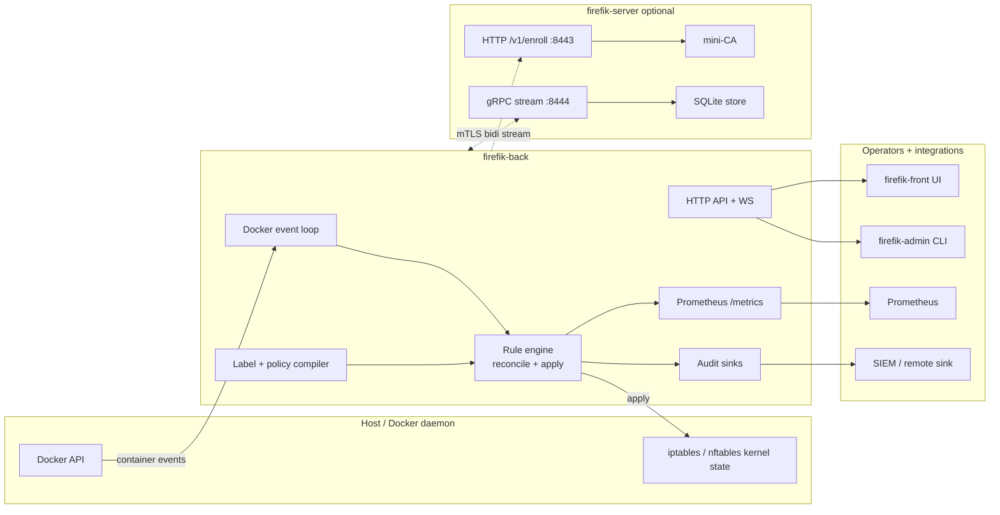
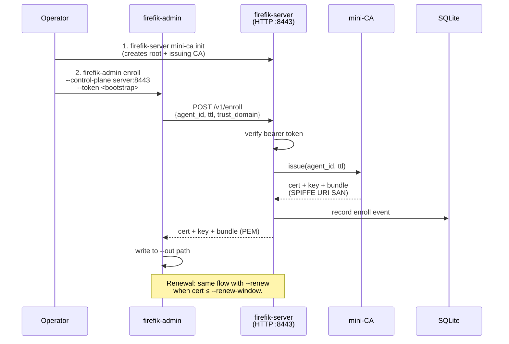
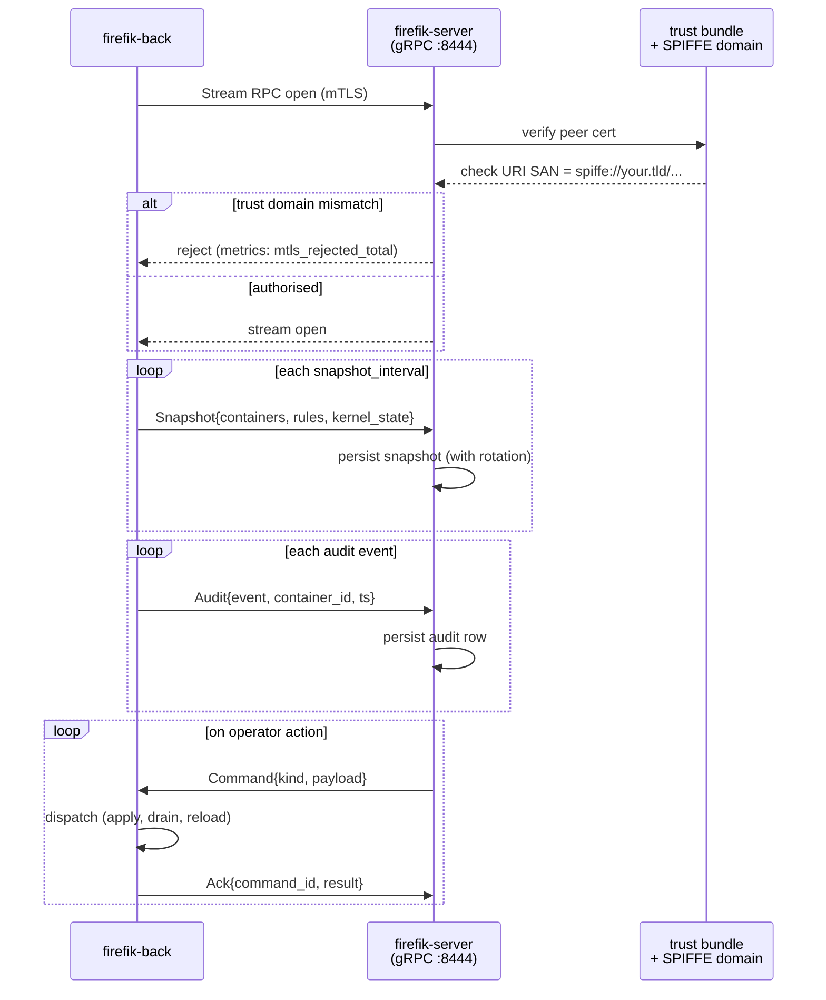
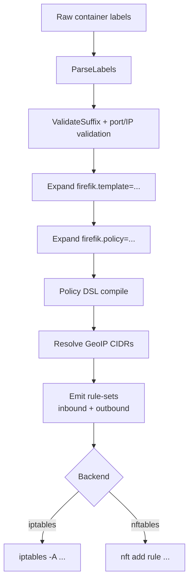
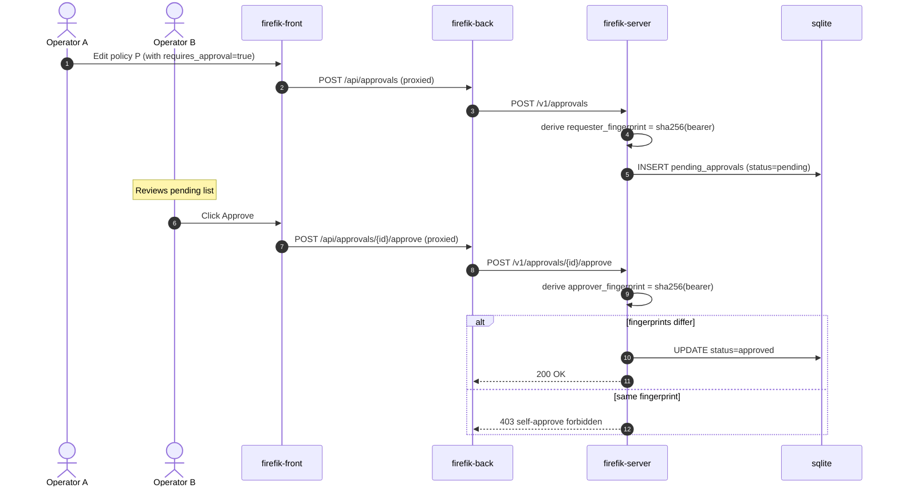
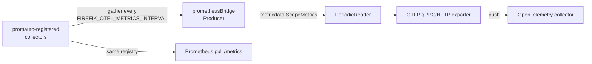
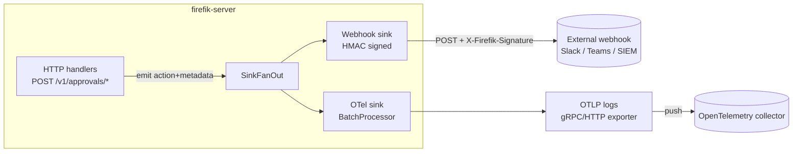

# Firefik — Architecture

High-level flow diagrams for the key paths. Paired with narrative in
[operations.md](operations.md).

---

## 1 — High-level components



Key points:

- Kernel is source of truth; firefik derives memory state from kernel
  on startup (`Rehydrate`), not the other way around.
- Control plane is optional. Agents work autonomously without
  firefik-server; no fleet feature (policy push, audit aggregation)
  depends on server uptime for agent-local firewall state.

---

## 2 — Agent event loop (per-container path)

```mermaid
sequenceDiagram
  actor User as Container owner
  participant Docker
  participant Events as Event loop
  participant Labels as Label compiler
  participant Engine
  participant Kernel as iptables/nftables
  participant Audit as Audit sinks

  User->>Docker: docker run --label firefik.enable=true ...
  Docker-->>Events: container.start event
  Events->>Docker: inspect(containerID)
  Docker-->>Events: labels + IPs
  Events->>Labels: parse(labels)
  Labels-->>Events: RuleSet
  Events->>Engine: ApplyContainer(ruleSet)
  Engine->>Kernel: iptables -N FIREFIK-<id>;<br/>iptables -A ...
  Kernel-->>Engine: ok
  Engine->>Audit: rule_applied{id, rules=N}
  Engine-->>Events: done

  Note over Events,Engine: Reconciler also runs every N seconds<br/>and on drift detection
```

---

## 3 — Control plane: enrollment



---

## 4 — Control plane: bi-directional stream



Reconnect: agent uses exponential backoff (1s → 60s cap) on
disconnect. `firefik_controlplane_connection_state` reports live
value. All local firewall enforcement continues during disconnect.

---

## 5 — Audit fan-out

```mermaid
flowchart LR
  EVENT[Audit event produced]
  EVENT --> FORK{fan-out}

  FORK --> SLOG[slog<br/>(stderr)]
  FORK --> FILE[JSON file sink<br/>+ lumberjack rotation]
  FORK --> CEF[CEF file sink]
  FORK --> REMOTE[remote NDJSON HTTP POST]

  FILE --> ROT[rotated archives<br/>size / backups / age / gzip]
  CEF --> ROT
  REMOTE --> SIEM[SIEM<br/>(Splunk / ArcSight / ELK)]
```

- Sinks are configured via `FIREFIK_AUDIT_SINK` (comma-separated list).
- Each sink writes independently; one failing doesn't block the others.
- Write path is non-blocking (bounded channel); full channel ⇒
  drop + increment internal counter.

---

## 6 — Label → kernel rule compile pipeline



Every transform is pure — given the same labels + policy files +
GeoIP DB version, output is deterministic. This makes `firefik-admin
explain --packet` behaviour reproducible.

---

## 7 — Blue/green chain swap

```mermaid
flowchart LR
  subgraph Before
    P1[DOCKER-USER -j FIREFIK]
    P1 --> OLD[FIREFIK<br/>(old rules)]
  end

  subgraph Stage
    NEW[FIREFIK-v2<br/>(new rules, installed but unreachable)]
    P2[DOCKER-USER -j FIREFIK]
    P2 --> OLD2[FIREFIK]
    NEW -.dry.-> NEW
  end

  subgraph Swap
    P3[DOCKER-USER -j FIREFIK-v2]
    P3 --> NEW3[FIREFIK-v2]
    OLD3[FIREFIK<br/>(orphan)] -.reap.-> X(( ))
  end

  Before --> Stage
  Stage --> Swap
```

`firefik-admin reap --suffix=""` removes the old chain-tree after the
soak window. Parent-chain jump is swapped atomically with a single
`iptables -R` (replace rule).

---

## 8 — Policy approval gate (4-eyes, v0.12+)



The fingerprint is `sha256(bearer_token)[:16]`. Two operators must
hold distinct tokens (typically distinct named tokens via
`FIREFIK_API_TOKEN_FILE` rotation across hosts). Same-token approval
returns `ErrSelfApprove → 403 Forbidden`.

---

## 9 — OTel metrics bridge (v0.12+)



The bridge keeps a **single source of truth** in Prometheus collectors;
the OTel side is a fan-out, not a parallel registry. Counters → Sum
(monotonic, cumulative). Gauges → Gauge. Histograms → Histogram with
preserved bucket boundaries. Summaries are skipped (OTLP has no native
mapping for Prometheus quantile summaries).

---

## 10 — OTel logs bridge + approval webhook fan-out (v0.13+)



`policy_approval_requested`, `policy_approval_approved`,
`policy_approval_rejected` events are emitted from the HTTP handlers
inside firefik-server (not the agent). The fan-out is opt-in: a
configured `FIREFIK_WEBHOOK_URL` activates the webhook sink, and a
`FIREFIK_OTEL_LOGS_ENABLED=true` activates the OTel sink. With no
config, events are silently dropped at the fan-out (the store still
records them).

The OTel sink writes log records with severity by action: ERROR for
`rule_apply_failed`, WARN for `rule_drift_detected` and
`policy_approval_rejected`, INFO otherwise. Body is the JSON-serialised
`audit.Event`; attributes carry `audit.action`, `audit.source`,
`audit.container_id`, etc.

---

## Invariants (enforced by code; see design-notes for motivation)

- **Rule-set deterministic**: same inputs → same output chain, byte-
  for-byte. Tested against `testdata/golden/`.
- **Never partial apply**: a container's rule-set applies either
  fully or not at all (apply → swap-in via temporary chain on
  iptables, atomic table swap on nftables).
- **Audit-before-kernel**: audit write happens on the *success* path
  of the kernel apply, but the kernel side is the source of truth —
  re-apply from labels is always safe.
- **No kernel state outside FIREFIK chain-tree**: firefik never
  modifies `INPUT` / `FORWARD` / `OUTPUT` / `DOCKER-USER` rules except
  the one parent-chain jump.

---

## See also

- [operations.md](operations.md) — narrative ops.
- [control-plane.md](control-plane.md) — gRPC + enrollment detail.
